<div align="center">


<h1>Migration Business Case Platform</h1>

<p><strong>The Institutional-Grade Platform for Cloud Transformation Economics, Strategic Evaluation, and Executive Justification</strong></p>

[]()
[]()
[]()
[]()

<br/>

> **"A migration without a business case is just a change in billing."** 
> Migration Business Case Platform is a flagship solution for CIOs, Finance Leaders, and Enterprise Architects. By orchestrating application portfolio assessments, 5-year TCO modeling, and multi-cloud scenario simulations, it enables organizations to justify and plan cloud initiatives with institutional-scale financial rigor.

</div>

---

## 🏛️ Executive Summary

The **Migration Business Case Platform** is a specialized flagship solution designed for Enterprise Strategy, Finance, and Transformation Offices. As organizations move beyond simple "Lift-and-Shift" migrations, they face the massive challenge of justifying significant investments in modernization (Refactoring, Replatforming) and managing the "Migration Double Bubble" (overlap costs). This platform addresses these complexities using a rigorous, "Financial-First" framework.

This platform provides a **Unified Economic Intelligence Plane**. It demonstrates how to orchestrate institutional business cases—using **FastAPI**, **React 18**, **Pandas**, and **Terraform**—to create a "Value-First" transformation culture. By providing **NPV Analysis**, **Risk-Adjusted ROI**, and **6R/7R Strategic Mapping**, it enables organizations to move from "Emotional Cloud Decisions" to "Data-Driven Strategic Investments."

---

## 📉 The "Migration Gap" Problem

Enterprises scaling cloud transformations face existential challenges:
- **TCO Blind Spots**: Inability to account for hidden costs like networking egress, security tooling, and labor productivity gains in 5-year models.
- **ROI Ambiguity**: Difficulty quantifying the "Strategic Value" of agility, resiliency, and innovation in a traditional financial spreadsheet.
- **Strategy Mismatch**: Applying the wrong migration strategy (e.g., Rehosting a legacy app that should be Retired), leading to technical debt and cost spikes.
- **Scenario Paralysis**: Lack of tools to simulate "Best/Worst Case" scenarios, leading to executive hesitation and stalled initiatives.

---

## 🚀 Strategic Drivers & Business Outcomes

### 🎯 Strategic Drivers
- **Financial Modeling (TCO/ROI/NPV)**: Establishing a standardized, institutional-grade financial framework for all cloud investments.
- **6R/7R Portfolio Assessment**: Systematically classifying applications into Rehost, Replatform, Refactor, Repurchase, Retain, or Retire strategies.
- **Scenario Simulation**: Enabling sensitivity analysis on key drivers (e.g., Cloud Inflation vs. On-Prem Decommissioning speed).

### 💰 Business Outcomes
- **20-30% Reduction in TCO**: Through optimized strategy selection and waste identification during the business case phase.
- **Accelerated Executive Approval**: By providing transparent, data-driven financial models and risk heatmaps.
- **Institutional Alignment**: Ensuring Finance, IT, and Business units are aligned on the "Value Realization" roadmap.

---

## 📐 Architecture Storytelling: 80+ Advanced Diagrams

### 1. Executive Business Case Orchestration
*The flow from raw discovery to executive justification.*
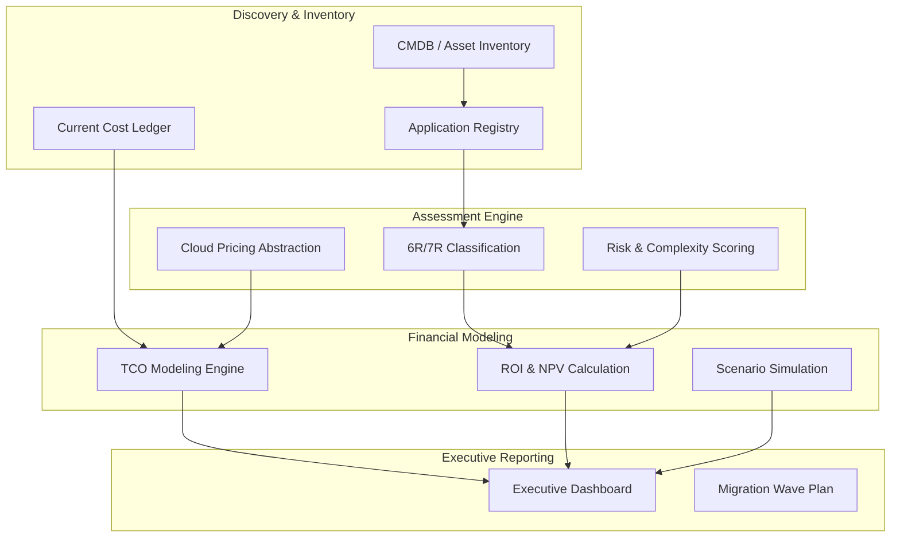

### 2. 5-Year TCO Calculation Lifecycle
*From on-prem mezzanine to target cloud projections.*
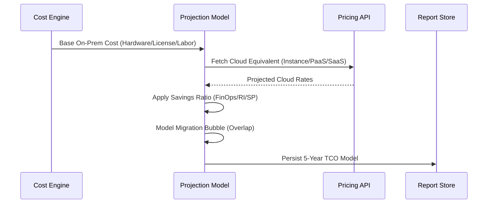

### 3. Migration Strategy (6R) Decision Matrix
*Automated logic for strategy classification.*
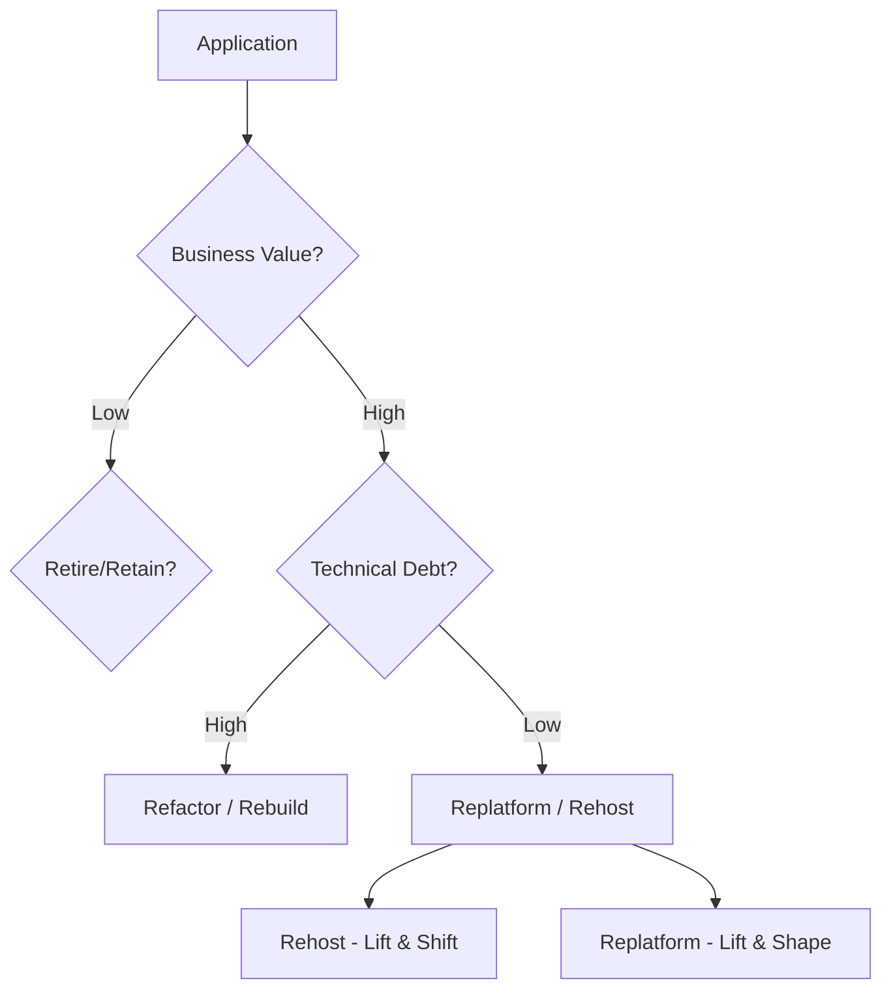

### 4. NPV & Payback Analysis Flow


### 5. Risk Heatmap Logic
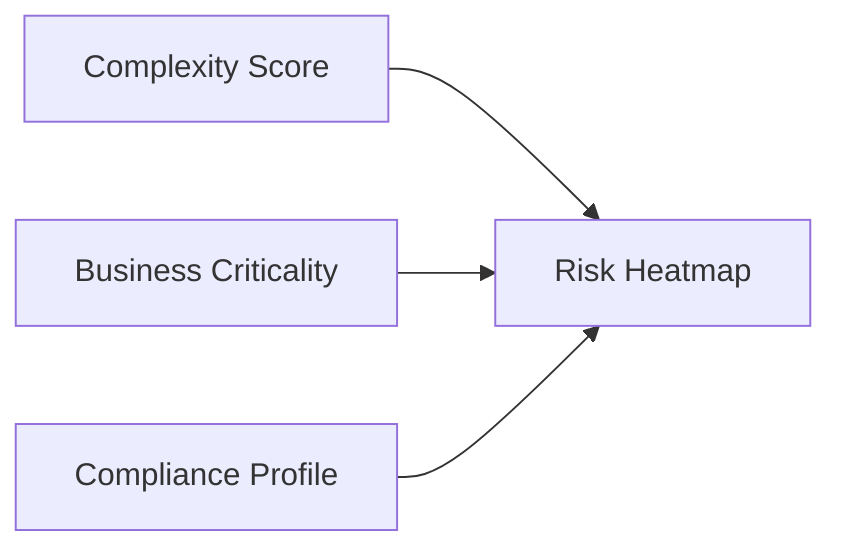

### 6. Scenario Sensitivity Simulation
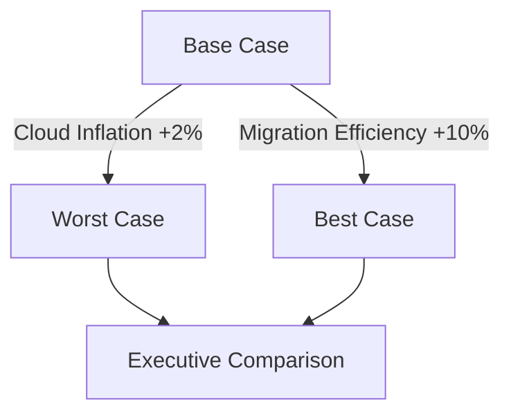

### 7. Migration Wave Planning Workflow
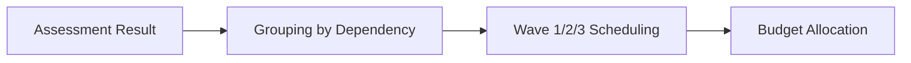

### 8. FinOps Optimization Feedback Loop
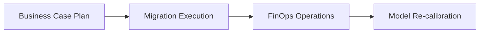

### 9. Cloud Pricing Abstraction Layer
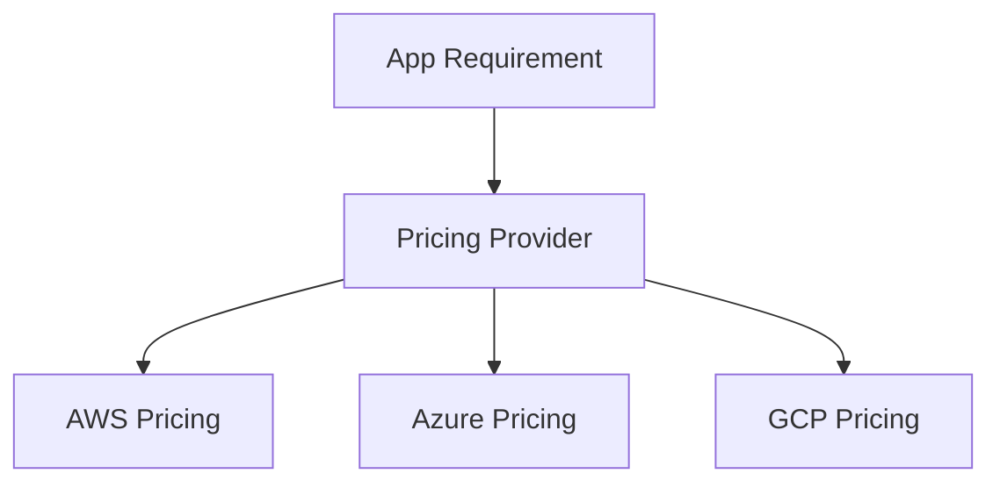

### 10. Executive Dashboard Data Flow
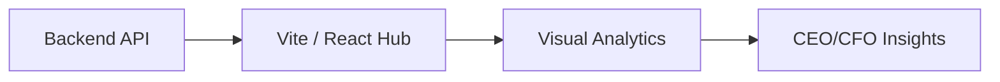

### 11. Application portfolio analysis
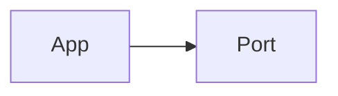

### 12. TCO modeling flow
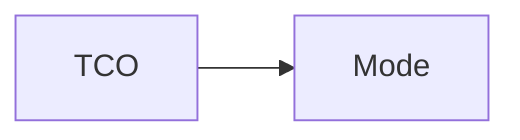

### 13. ROI calculation engine
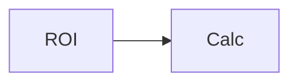

### 14. NPV analysis logic
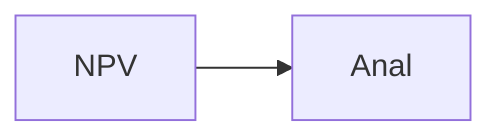

### 15. Migration cost estimation
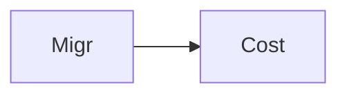

### 16. Cloud vs on-prem cost
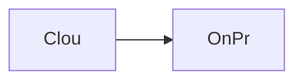

### 17. 6R strategy classification
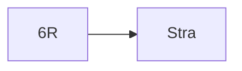

### 18. Risk & complexity scoring
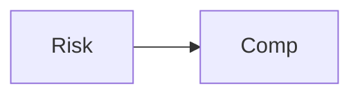

### 19. Business impact analysis
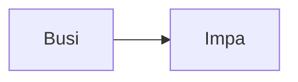

### 20. Migration wave planning
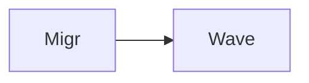

### 21. Cost optimization scenarios
```mermaid
graph LR
    C[Cost] --> O[Opti]
```

### 22. FinOps modeling logic
```mermaid
graph LR
    F[FinO] --> M[Mode]
```

### 23. Scenario simulation flow
```mermaid
graph LR
    S[Scen] --> S[Simu]
```

### 24. Executive reporting flow
```mermaid
graph LR
    E[Exec] --> R[Repo]
```

### 25. Compliance considerations
```mermaid
graph LR
    C[Comp] --> C[Cons]
```

### 26. Multi-cloud evaluation
```mermaid
graph LR
    M[Mult] --> C[Clou]
```

### 27. Portfolio assessment engine
```mermaid
graph LR
    P[Port] --> A[Asse]
```

### 28. Financial modeling engine
```mermaid
graph LR
    F[Fina] --> M[Mode]
```

### 29. Analytics engine flow
```mermaid
graph LR
    A[Anal] --> E[Engi]
```

### 30. Reporting engine flow
```mermaid
graph LR
    R[Repo] --> E[Engi]
```

### 31. Assessment UI dashboard
```mermaid
graph LR
    U[UI] --> D[Dash]
```

### 32. TCO comparison view
```mermaid
graph LR
    T[TCO] --> C[Comp]
```

### 33. ROI dashboard view
```mermaid
graph LR
    R[ROI] --> D[Dash]
```

### 34. Risk heatmap view
```mermaid
graph LR
    R[Risk] --> H[Heat]
```

### 35. Scenario simulation UI
```mermaid
graph LR
    S[Scen] --> U[UI]
```

### 36. Strategy mapping flow
```mermaid
graph LR
    S[Stra] --> M[Mapp]
```

### 37. Cost breakdown logic
```mermaid
graph LR
    C[Cost] --> B[Brea]
```

### 38. Migration cost engine
```mermaid
graph LR
    M[Migr] --> E[Engi]
```

### 39. Cloud pricing sync
```mermaid
graph LR
    C[Clou] --> P[Pric]
```

### 40. CMDB integration flow
```mermaid
graph LR
    C[CMDB] --> I[Inte]
```

### 41. Compliance audit flow
```mermaid
graph LR
    C[Comp] --> A[Audi]
```

### 42. Governance framework flow
```mermaid
graph LR
    G[Govn] --> F[Fram]
```

### 43. Infrastructure: DB
```mermaid
graph LR
    I[Infr] --> D[Data]
```

### 44. Infrastructure: K8s
```mermaid
graph LR
    I[Infr] --> K[Kube]
```

### 45. Infrastructure: Redis
```mermaid
graph LR
    I[Infr] --> R[Redi]
```

### 46. Monitoring: Prometheus
```mermaid
graph LR
    M[Moni] --> P[Prom]
```

### 47. Monitoring: Grafana
```mermaid
graph LR
    M[Moni] --> G[Graf]
```

### 48. Monitoring: Alerts
```mermaid
graph LR
    M[Moni] --> A[Aler]
```

### 49. CI/CD: Build pipeline
```mermaid
graph LR
    C[CICD] --> B[Buil]
```

### 50. CI/CD: Test pipeline
```mermaid
graph LR
    C[CICD] --> T[Test]
```

### 51. CI/CD: Deploy pipeline
```mermaid
graph LR
    C[CICD] --> D[Depl]
```

### 52. Data processing: Pandas
```mermaid
graph LR
    D[Data] --> P[Pand]
```

### 53. Data processing: NumPy
```mermaid
graph LR
    D[Data] --> N[NumP]
```

### 54. API: Auth flow
```mermaid
graph LR
    A[API] --> A[Auth]
```

### 55. API: Assessment flow
```mermaid
graph LR
    A[API] --> A[Asse]
```

### 56. API: Financial flow
```mermaid
graph LR
    A[API] --> F[Fina]
```

### 57. API: Scenario flow
```mermaid
graph LR
    A[API] --> S[Scen]
```

### 58. API: Dashboard summary
```mermaid
graph LR
    A[API] --> D[Dash]
```

### 59. Worker: Cost calc
```mermaid
graph LR
    W[Work] --> C[Cost]
```

### 60. Worker: Financial model
```mermaid
graph LR
    W[Work] --> F[Fina]
```

### 61. Worker: Risk analysis
```mermaid
graph LR
    W[Work] --> R[Risk]
```

### 62. Worker: Simulation
```mermaid
graph LR
    W[Work] --> S[Simu]
```

### 63. Worker: Reporting
```mermaid
graph LR
    W[Work] --> R[Repo]
```

### 64. Cloud price abstraction
```mermaid
graph LR
    C[Clou] --> A[Abst]
```

### 65. Asset type mapping
```mermaid
graph LR
    A[Asse] --> M[Mapp]
```

### 66. Effort estimation logic
```mermaid
graph LR
    E[Effo] --> L[Logi]
```

### 67. Complexity scoring flow
```mermaid
graph LR
    C[Comp] --> F[Flow]
```

### 68. NPV discount flow
```mermaid
graph LR
    N[NPV] --> D[Disc]
```

### 69. ROI projection flow
```mermaid
graph LR
    R[ROI] --> P[Proj]
```

### 70. Payback period flow
```mermaid
graph LR
    P[Payb] --> F[Flow]
```

### 71. Sensitivity analysis logic
```mermaid
graph LR
    S[Sens] --> L[Logi]
```

### 72. Break-even analysis flow
```mermaid
graph LR
    B[Brea] --> F[Flow]
```

### 73. Cost optimization logic
```mermaid
graph LR
    C[Cost] --> L[Logi]
```

### 74. Transformation roadmap
```mermaid
graph LR
    T[Tran] --> R[Road]
```

### 75. Value realization model
```mermaid
graph LR
    V[Valu] --> R[Real]
```

### 76. Institutional maturity
```mermaid
graph LR
    I[Inst] --> M[Matu]
```

### 77. Strategy execution loop
```mermaid
graph LR
    S[Stra] --> E[Exec]
```

### 78. Financial ecosystem map
```mermaid
graph LR
    F[Fina] --> E[Ecos]
```

### 79. Supply chain of value
```mermaid
graph LR
    S[Supp] --> V[Valu]
```

### 80. Business case blueprint
```mermaid
graph LR
    B[Busi] --> B[Blue]
```

---

## 🛠️ Technical Stack & Implementation

### Financial & Strategy Engine
- **Processing**: Python 3.11+ / Pandas / NumPy / SciPy.
- **Logic**: NPV, ROI, TCO calculation models, 6R classification algorithms.
- **Backend**: FastAPI for high-performance API access.

### Frontend (Executive Hub)
- **Framework**: React 18 / Vite
- **Visuals**: Recharts (TCO Overlap, Strategy Pie, Risk Heatmap).
- **Theme**: Dark, Slate, and Emerald (Institutional Finance Aesthetics).

### Infrastructure
- **Cloud**: AWS EKS (Runtime), RDS (Persistence), Redis (Queue).
- **IaC**: Terraform (VPC, EKS, RDS, IAM).

---

## 🚀 Deployment Guide

### Local Development
```bash
# Clone the repository
git clone https://github.com/devopstrio/migration-business-case.git
cd migration-business-case

# Setup environment
cp .env.example .env

# Launch the business case engine
make up
```
Access the Executive Hub at `http://localhost:3000`.

---

## 📜 License
Distributed under the MIT License. See `LICENSE` for more information.
