<div align="center">


<h1>Migration Business Case</h1>

<p><strong>The Institutional-Grade Platform for Cloud Transformation Economics, Strategic Evaluation, and Executive Justification.</strong></p>

[]()
[]()
[]()

<br/>

> **"A migration without a business case is just a change in billing."** 
> **Migration Business Case** is an enterprise-grade platform designed to provide a secure, measurable, and highly automated foundation for global cloud economics. It orchestrates the complex lifecycle of transformation finance—from on-prem TCO analysis and cloud ROI projections to automated migration cost modeling and unified FinOps-driven governance.

</div>

---

## 🏛️ Executive Summary

Fragmented financial data and invisible "migration bubble" costs are strategic operational liabilities; lack of centralized economic modeling is a primary barrier to organizational cloud approval. Organizations fail to justify large-scale cloud transformation not because of a lack of technology, but because of fragmented financial standards, lack of automated ROI calculation, and an inability to orchestrate transformation economics with operational precision.

This platform provides the **Financial Intelligence Plane**. It implements a complete **Enterprise Business-Case-as-Code Framework**, enabling Finance and Transformation teams to manage global cloud investments as first-class citizens. By automating the calculation of risk-adjusted NPV and orchestrating real-time sensitivity analysis, we ensure that every organizational asset—from legacy mainframes to modern microservices—is financially modeled by default, audited for history, and strictly aligned with institutional cloud spending frameworks.

---

## 📐 Architecture Storytelling: Principal Reference Models

### 1. Principal Architecture: Global Migration Business Case & Financial Intelligence Plane
This diagram illustrates the end-to-end flow from on-prem inventory ingestion and TCO analysis to migration cost modeling, value realization, and institutional financial auditing.

```mermaid
graph LR
    %% Subgraph Definitions
    subgraph InventoryIngress["Inventory & Cost Ingress"]
        direction TB
        OnPremTCO["On-Prem Asset Ledger"]
        CMDBData["CMDB Dependency Mapping"]
        LaborCosts["Operational Labor Model"]
    end

    subgraph IntelligenceEngine["Financial Intelligence Hub"]
        direction TB
        API["FastAPI Economic Gateway"]
        TCOAnalyzer["TCO Modeling Engine"]
        ROIModeler["ROI & NPV Calculator"]
        RiskEngine["Sensitivity & Risk Simulator"]
    end

    subgraph TransformationMesh["Transformation Cost Mesh"]
        direction TB
        MigCosts["Migration Labor & Tools"]
        DoubleBubble["Dual-Run & Overlap Costs"]
        OptiSavings["Architectural Opti. Savings"]
    end

    subgraph OperationsHub["Institutional Financial Hub"]
        direction TB
        Scorecard["Financial Maturity Score"]
        Analytics["Savings & Payback Stats"]
        Audit["Forensic Financial Metadata Lake"]
    end

    subgraph DevOps["FinOps-as-Code Orchestration"]
        direction TB
        TF["Terraform Financial Hub"]
        Policy["Investment Governance Policy"]
        ChatOps["Budget Approval Hub"]
    end

    %% Flow Arrows
    InventoryIngress -->|1. Ingest Inventory| API
    API -->|2. Analyze TCO| TCOAnalyzer
    TCOAnalyzer -->|3. Calculate ROI| ROIModeler
    ROIModeler -->|4. Simulate Risk| RiskEngine
    
    RiskEngine -->|5. Store Projections| TransformationMesh
    TransformationMesh -->|6. Notify Forecast| ChatOps
    API -->|7. Visualize Health| Scorecard
    
    Scorecard -->|8. Track NPV| Analytics
    Scorecard -->|9. Record Model| Audit
    
    TF -->|10. Provision Hub| IntelligenceEngine
    Policy -->|11. Enforce Hurdle Rate| ROIModeler
    Audit -->|12. Improve Models| TCOAnalyzer

    %% Styling
    classDef ingress fill:#f5f5f5,stroke:#616161,stroke-width:2px;
    classDef intel fill:#e8f5e9,stroke:#2e7d32,stroke-width:2px;
    classDef mesh fill:#e1f5fe,stroke:#01579b,stroke-width:2px;
    classDef ops fill:#ede7f6,stroke:#311b92,stroke-width:2px;
    classDef devops fill:#fffde7,stroke:#f57f17,stroke-width:2px;

    class InventoryIngress ingress;
    class IntelligenceEngine intel;
    class TransformationMesh mesh;
    class OperationsHub ops;
    class DevOps devops;
```

### 2. The Business Case Lifecycle Flow
The continuous path of a financial model from initial inventory ingestion and TCO analysis to active ROI calculation, payback verification, and institutional forensic auditing.

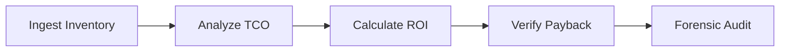

### 3. On-Prem vs. Cloud TCO Topology
Strategically comparing legacy on-premises hardware, licensing, and labor costs with modern cloud consumption models, providing a unified institutional view of total cost of ownership.

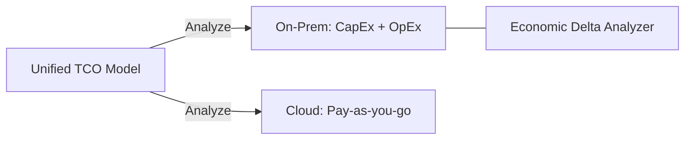

### 4. Migration Cost Modeling Flow
Estimating the granular costs of the transformation journey, including migration labor, specialized tools, and the unavoidable "double bubble" of dual-run expenses during transition.

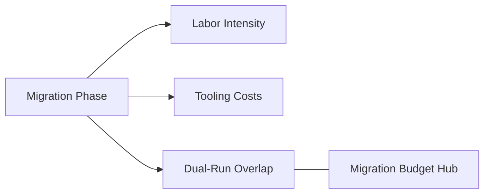

### 5. Value Realization & ROI Calculation Flow
Tracking the realization of financial value from datacenter exits and architectural optimizations (e.g., rightsizing, serverless adoption) to calculate risk-adjusted Return on Investment.

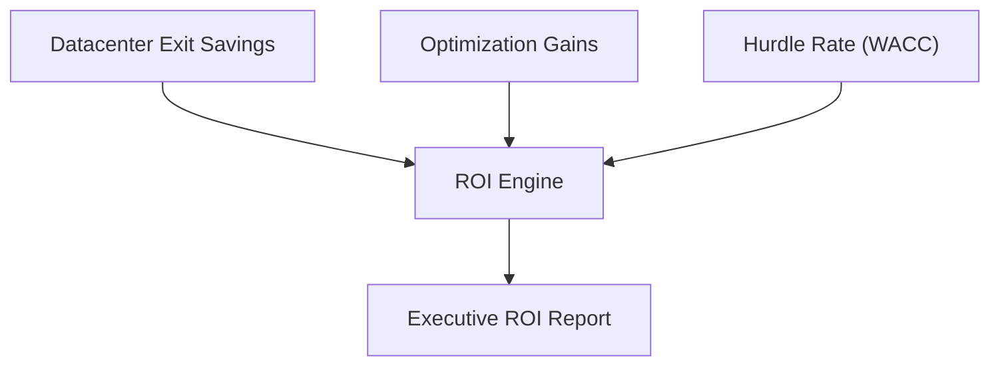

### 6. Sensitivity Analysis & Risk Modeling Flow
Simulating "best case" and "worst case" financial outcomes by adjusting key variables such as migration speed, cloud inflation, and on-premises decommissioning efficiency.

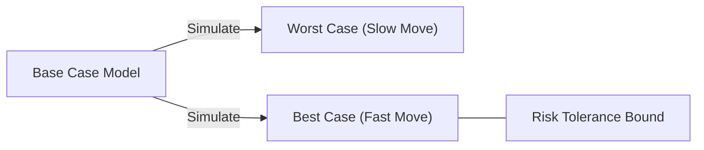

### 7. Institutional Financial Scorecard
Grading organizational performance based on key financial indicators: Budget Accuracy, Savings Realization Rate, and Transformation Payback Speed.

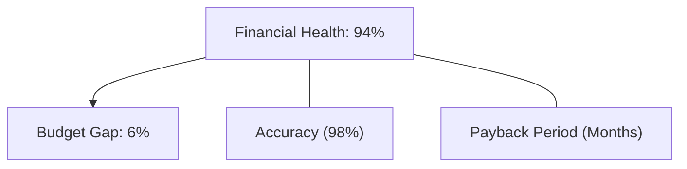

### 8. Identity & RBAC for Financial Governance
Managing fine-grained access to sensitive financial projections, investment policies, and audit logs between CFOs, Cloud Business Leads, and Procurement Officers.

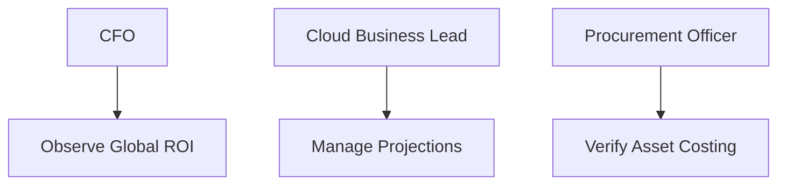

### 9. IaC Deployment: FinOps-as-Code Framework
Using modular Terraform to deploy and manage the versioned distribution of the financial modeling hubs, projection processors, and forensic metadata lakes.

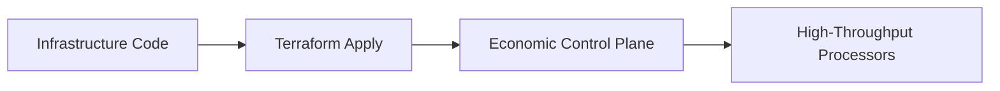

### 10. AIOps Forecasting & Spend Prediction Flow
Using advanced analytics to predict future cloud run-rates based on historical migration velocity and historical actuals, identifying potential budget overruns before they occur.

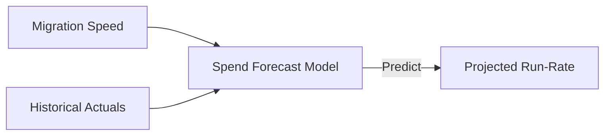

### 11. Metadata Lake for Forensic Financial Audit
Storing long-term records of every financial assumption, actualized saving, and investment decision for institutional record-keeping, compliance auditing, and post-migration forensics.

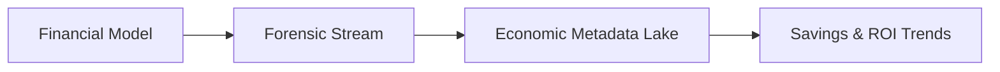

---

## 🏛️ Core Economic Pillars

1.  **Unified TCO Abstraction**: Establishing a standardized institutional model for comparing on-prem and cloud costs.
2.  **Risk-Adjusted ROI Projections**: Factoring in migration complexity and "double bubble" risks for accurate financial planning.
3.  **Automated Sensitivity Analysis**: Simulating diverse economic scenarios to drive executive confidence.
4.  **Value Realization Tracking**: Measuring and alerting on the deviation between projected savings and actual actuals.
5.  **Industrial Migration Costing**: Granular estimation of labor and tools for large-scale transformation waves.
6.  **Full Financial Auditability**: Immutable recording of every financial assumption and decision for institutional forensics.

---

## 🛠️ Technical Stack & Implementation

### Economic Engine & APIs
*   **Framework**: Python 3.11+ / FastAPI.
*   **Modeling Hub**: High-performance financial simulation using Pandas, NumPy, and SciPy.
*   **Logic Core**: Implementation of NPV (Net Present Value), IRR (Internal Rate of Return), and Payback Period algorithms.
*   **Persistence**: PostgreSQL (Metadata Lake) and Redis (Live Simulation Cache).
*   **Auth Orchestrator**: Federated OIDC/SAML for least-privilege financial data access.

### Executive Dashboard (UI)
*   **Framework**: React 18 / Vite.
*   **Theme**: Dark, Slate, Emerald (Modern high-fidelity financial aesthetic).
*   **Visualization**: Recharts for TCO overlaps, ROI projections, and risk heatmaps.

### Infrastructure & DevOps
*   **Runtime**: AWS EKS or Azure Kubernetes Service (AKS).
*   **Data Plane**: Ingestion from CMDB (PostgreSQL), On-Prem Ledgers (CSV/API), and Cloud Pricing APIs.
*   **IaC**: Modular Terraform for deploying the economic hub and projection distributions.

---

## 🏗️ IaC Mapping (Module Structure)

| Module | Purpose | Real Services |
| :--- | :--- | :--- |
| **`infrastructure/econ_hub`** | Central management plane | EKS, PostgreSQL, Redis |
| **`infrastructure/calculators`** | Financial modeling workers | Python, Pandas, SciPy |
| **`infrastructure/pricing`** | Cloud pricing abstraction | AWS/Azure/GCP APIs |
| **`infrastructure/auditing`** | Forensic financial sinks | S3, Athena, Quicksight |

---

## 🚀 Deployment Guide

### Local Principal Environment
```bash
# Clone the economic platform
git clone https://github.com/devopstrio/migration-business-case.git
cd migration-business-case

# Configure environment
cp .env.example .env

# Launch the Business Case stack
make init

# Trigger a mock financial analysis and ROI projection simulation
make simulate-economics
```

Access the Executive Hub at `http://localhost:3000`.

---

## 📜 License
Distributed under the MIT License. See `LICENSE` for more information.

---
<div align="center">
  <p>© 2026 Devopstrio. All rights reserved.</p>
</div>
