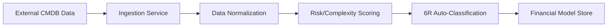
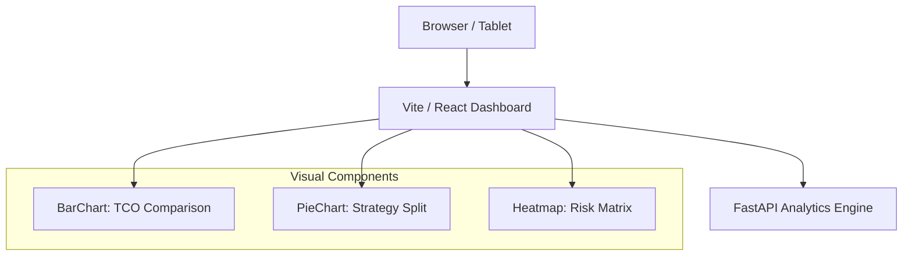
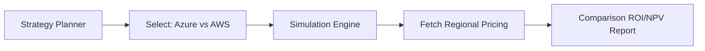

# Architecture & Data Flow Diagrams

## 31. Portfolio Assessment Data Pipeline

```mermaid
graph LR
    CMDB[External CMDB Data] --> Ingest[Ingestion Service]
    Ingest --> Clean[Data Normalization]
    Clean --> Score[Risk/Complexity Scoring]
    Score --> Strategy[6R Auto-Classification]
    Strategy --> Model[Financial Model Store]
```

## 40. Executive Dashboard Rendering Architecture

```mermaid
graph TD
    Client[Browser / Tablet] --> React[Vite / React Dashboard]
    subgraph "Visual Components"
        B[BarChart: TCO Comparison]
        P[PieChart: Strategy Split]
        H[Heatmap: Risk Matrix]
    end
    React --> B
    React --> P
    React --> H
    React --> API[FastAPI Analytics Engine]
```

## 50. Multi-Cloud Scenario Simulation Flow

```mermaid
graph LR
    User[Strategy Planner] --> Scenario[Select: Azure vs AWS]
    Scenario --> Engine[Simulation Engine]
    Engine --> Bench[Fetch Regional Pricing]
    Bench --> Result[Comparison ROI/NPV Report]
```
