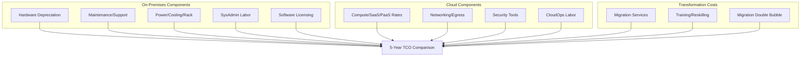
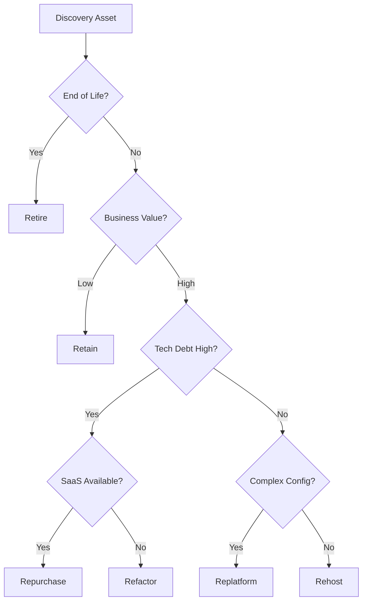

# Finance & Strategy Modeling Diagrams

## 11. Comprehensive TCO Calculation Logic
*The deep-dive into on-prem vs. cloud cost components.*



## 15. NPV (Net Present Value) Discounting Flow
```mermaid
graph LR
    Cash1[Year 1 Cash Flow] --> Disc1[Discount: (1+r)^1]
    Cash2[Year 2 Cash Flow] --> Disc2[Discount: (1+r)^2]
    Cash3[Year 3 Cash Flow] --> Disc3[Discount: (1+r)^3]
    Disc1 --> Sum[Sum of Present Values]
    Disc2 --> Sum
    Disc3 --> Sum
    Sum --> NPV[Subtract Initial Migration Investment]
```

## 20. 6R Migration Strategy Decision Logic (Extended)

